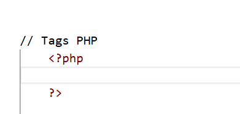

# PHP Programming Screenshots

This folder contains screenshots demonstrating PHP programming concepts covered in the course **Web Application Development - PHP & MySQL**.

# PHP Introduction Screenshots

This folder contains screenshots explaining the basic concepts of PHP in the course **Web Application Development - PHP & MySQL**.


## 1. PHP Tags

### Screenshot Name
`PHP_Tags.png`

### Screenshot


### Description
This screenshot demonstrates the basic PHP syntax structure.

PHP code is written inside PHP opening and closing tags:

```php
<?php

// PHP code goes here

?>
2. Echo and Print Statements
Screenshot Name
PHP_Echo_Print_Code.png

Screenshot
Description
This screenshot demonstrates how to generate output in PHP using:

echo

print

Both commands are used to display text in the browser.

Echo Example

echo "welcome home page php <br>";

echo("hi sumaya <br>");
Multiple Arguments with Echo
echo can display multiple values separated by commas.

Example:

echo "sumaya", "elmi <br>";
Variables and Output

$fullname = "zuu , elmi";
echo "my name is $fullname <br>";
String Word Count Function

$my_str = "welcome to php";
echo "tirada string waa ", str_word_count($my_str);
3. Difference Between Echo and Print
Description
This section explains the differences between echo and print as practiced in the code.

Echo
Used to output text from the server to the browser.

Can display one or more parameters separated by commas.

Does not return a value.

Usually faster than print.

echo "sumaya", "elmi";
Print
Used to display text in the browser.

Accepts only one parameter (cannot take multiple parameters separated by commas).

Returns a value of 1 (so it can be used in expressions).

print "hi sumaya";
Note: Parentheses are optional for both:

echo "welcome to php";
print "welcome to php";
or

echo ("welcome to php");
print ("welcome to php");